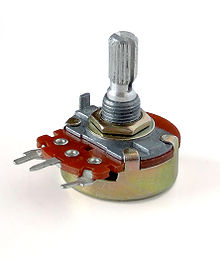

# Introduction - Material

During this workshop we'll be using the following material:

* Breadboard
* Jumper cables
* Resistor
* Photoresistor

## Breadboards

### How do breadboards work? 
Breadboards are one of the most fundamental pieces when learning how to build circuits. Next, you will learn how to use it.

### Why use breadboards?

Breadboards are great for making temporary circuits and prototyping, as they require no soldering.

Prototyping is the process of testing out an idea by creating a preliminary model from which other forms are developed or copied, and it is one of the most common uses for breadboards. If you aren’t sure how a circuit will react under a given set of parameters, it’s best to build a prototype and test it out.

For those new to electronics and circuits, breadboards are often the best place to start. That is the real beauty of breadboards – they can house both the simplest circuit as well as very complex circuits.

## Jumper cables

A jumper cable, also known as jumper, is an electrical wire with a connector or pin at each end, which is normally used to interconnect the components of a breadboard to test the circuit.

Jumpers are fitted by inserting their "end connectors" into the slots provided in a breadboard.

## Resistor

### What is a resistor?

Resistors are electronic components which have a specific, constant electrical resistance. The resistor’s resistance limits the flow of electrons through a circuit. They are passive components, meaning they only consume power (and can’t generate it). Resistors are usually added to circuits where they complement active components like op-amps, microcontrollers, and other integrated circuits. Commonly resistors are used to limit current, divide voltages, and pull-up I/O lines. (Don't bother understand this fully right now)

### The Ω

The electrical resistance of a resistor is measured in Ohms. The symbol for an Ohm is the greek capital-omega: Ω. The definition of 1Ω is the resistance between two points where 1 volt (1V) of applied potential energy will push 1 ampere (1A) of current.

As SI units go, larger or smaller values of Ohms can be matched with a prefix like kilo-, mega-, or giga-, to make large values easier to read. It’s very common to see resistors in the kilohm (kΩ) and megaohm (MΩ) range (much less common to see miliohm (mΩ) resistors). For example, a 4,700Ω resistor is equivalent to a 4.7kΩ resistor (that can also be represented as 4K7Ω), and a 5,600,000Ω resistor can be written as 5,600kΩ, 5.6MΩ or even 5M6Ω.

## Potentiometer

A potentiometer, informally a pot, is a three-terminal resistor with a sliding or rotating contact that forms an adjustable voltage divider. If only two terminals are used, one end and the wiper, it acts as a variable resistor or rheostat.
The measuring instrument called a potentiometer is essentially a voltage divider used for measuring electric potential (voltage); the component is an implementation of the same principle, hence its name. 
  

[Main Menu](../README.md) | [Next](./hiesp.md)
