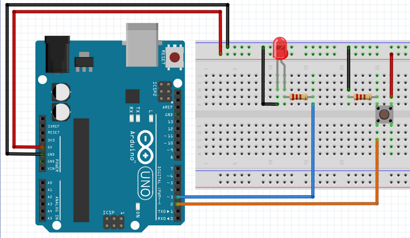

For the first 2 exercises let's setup our breadboard like it is in the picture!

Your microcontroller might be different and also the pins you are connecting too will probably be different too, so you need to adapt your code!
2 things to pay attention:
1. Pay attention if you are connecting the pin to an allowed GPIO;
2. The number displayed on the board, might not be the correct number of the GPIO, so google for your board pinout and figure out the correct number to use on software!

  
