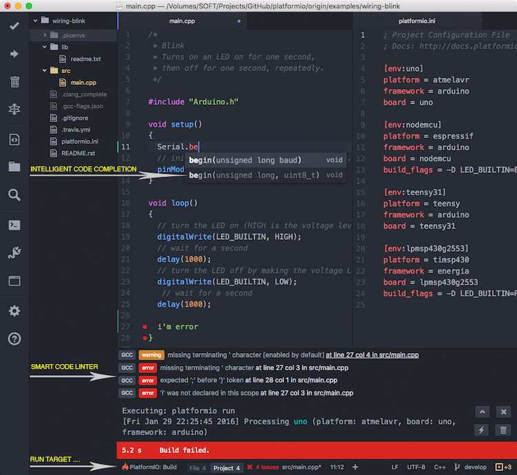

# Broaden Your Horizons

Now that you already know how to do some basic things with the arduino, it's time for you to get to know tools that will give you more power and will help you become an embedded systems ninja programmer.

## The Arduino IDE
This is what we were using today and altough it is pretty quick to set up, easy to use, there are some disadvantages that will make you want to use other plataform sooner or later.
First, it's very easy to use. While this is good to get your code up and running quick, it abstracts a lot of things that are important in embedded systems programming.
Also, the Arduino libraries are not very efficient in certain parts and waste RAM and CPU cycles. Overall, the Arduino IDE is not a very good code editor ( very limited debugging and it lacks some text editing features). Lets get to know more tools!

## I like the Arduino libraries but the IDE sucks
[PlatformIO](http://platformio.org/), that's what you will want to use. Built on top of Github's Atom, it supports the Arduino libraries and much more. You will get intelligent code completion, more debugging features and more. It is cross-platform, so it runs on all major operating systems. Make sure to check this out, this open-source project sure deserves attention.
 </br>

## I like to get under the hood
The Arduino microcontrollers are from Atmel, one of the leading microcontrollers manufacturer. If you want to unleash the full power of your chip, you will want to drop both the Arduino IDE and the Arduino libraries. What you will do is program the micro in pure C, using the AVR libraries and [Atmel Studio](http://www.atmel.com/microsite/atmel-studio/). It uses the Visual Studio interface, which is a pretty good IDE. You will have access to a great software framework and the best debugging features.
Have a look of this two codes, the first is programmed using the Arduino framework, the other is in pure C, using the AVR libraries. <br>
The Arduino code: <br>
```c++
 void setup() {
   pinMode(13, OUTPUT);
 }

 void loop() {
   digitalWrite(13, HIGH);
   delay(1000);
   digitalWrite(13, LOW);
   delay(1000);
 }

```
The Embedded C code: <br>
```c++
#define F_CPU 16000000UL // Sets the CPU frequency to 16Mhz

#include <avr/io.h>
#include <util/delay.h>

int main(void)
{

    DDRB |= (1<<0); // Set the pin as output
    while (1) 
    {
        PORTB |= (1<<0); // Pull the pin HIGH
        _delay_ms(1000);
        PORTB &= ~(1<<0); // Pull the pin LOW
        _delay_ms(1000);
    }
}
```
As you see, the code is more difficult to comprehend as it is more low-level, but the difference in the clock cycles is enormous, because a <code>digitalWrite()</code> function has a lot more going on than just pulling the passed pin HIGH.
## I live in the command line 
If you are the type of person that never leaves the command line, there is a way of programming your micros using a text editor of your choice (vim, emacs, nano,...) and then doing the build yourself.
As an example, use the code above and save it to a file **yourfile.c**. <br>

[Main Menu](../README.md)
