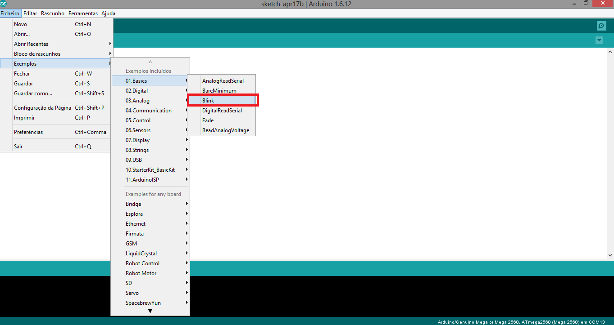
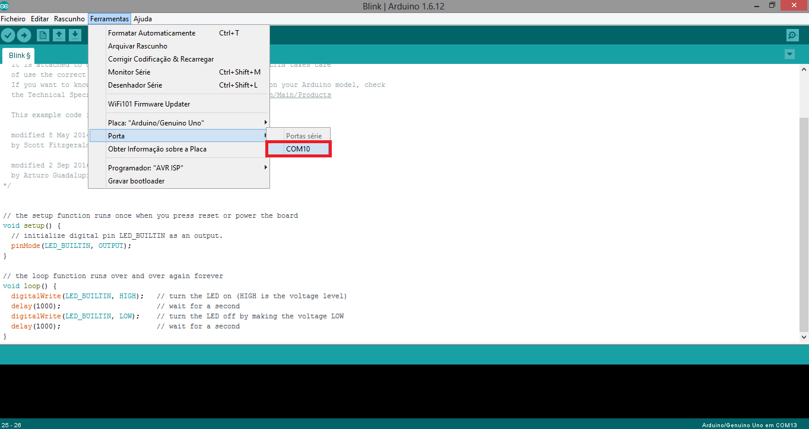
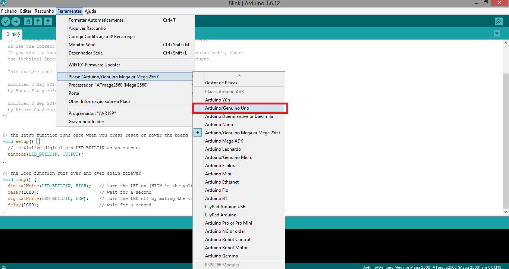
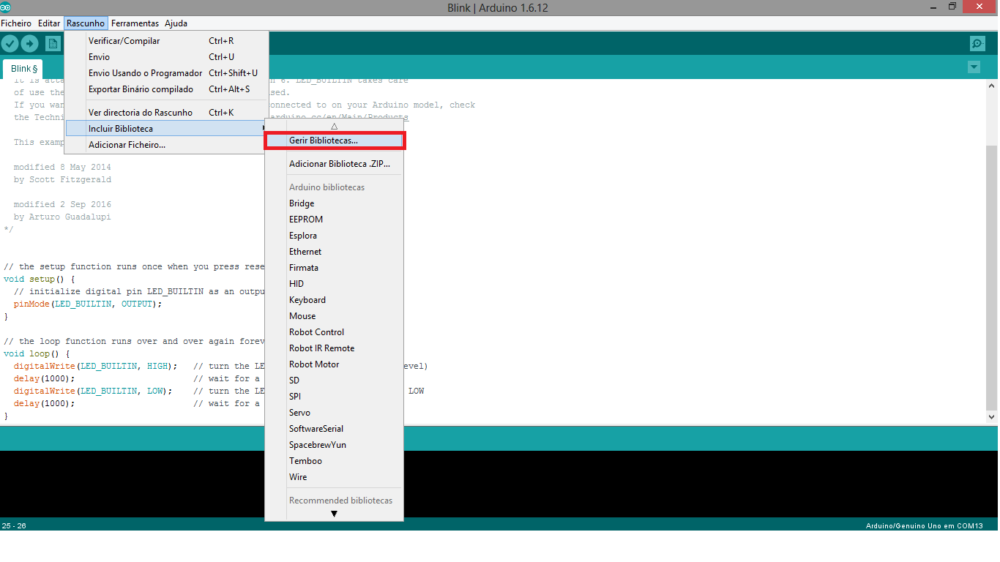
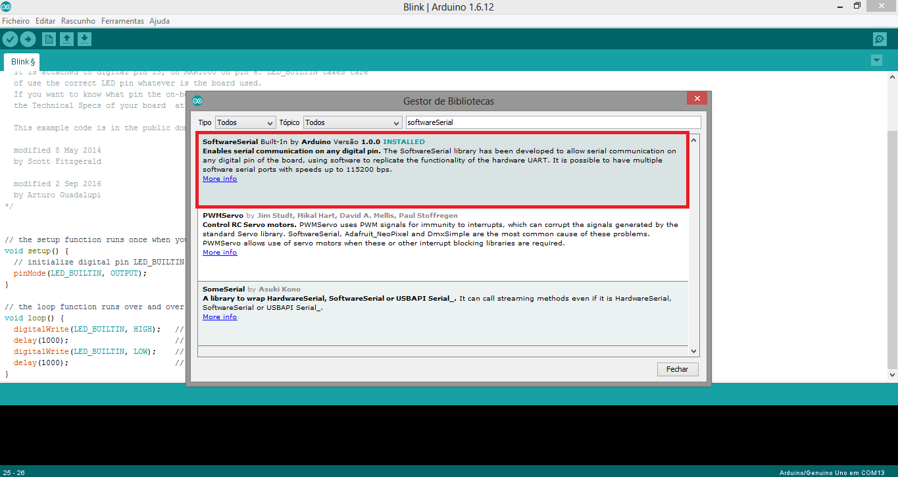
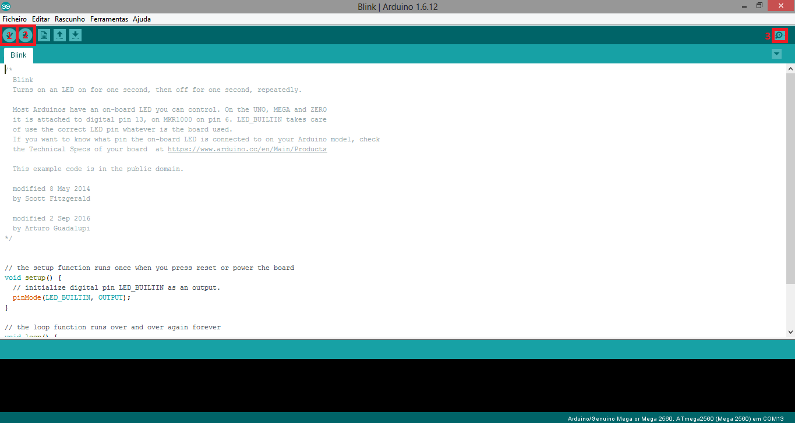

# Getting started with Arduino
All information in this topic can be skiped if you are already proficient in the Arduino IDE.

## Arduino IDE - built in Examples
The simplest Arduino example. Switch a LED state (ON /OFF)  every half a second. 

  
## Arduino IDE - Serial Port Selection
Everytime you plug an Arduino (Or any other USB), your system assigns it a different COM port. In this example, the arduino port is COM10, but It can be different in any PC that you plug the same Arduino. However, it will always be the same PORT if either the PC and the Arduino are the same.  
  

## Arduino IDE - Board Selection
Everytime you use the Arduino IDE, certify yourself that the IDE is compiling for the right Arduino board. This problem arises because not every Arduino has the same compiling restrictions since you can use the Arduino IDE to program other microcontrolers.   
  

## Arduino IDE - Including library
Throughout your Arduino experience, you will easily notice that you will need to include code from others. Some of that code is available on "Arduino official libraries". This is a trustable source of code which is really easy to import to your project. 
Here is how you do that. 
  
  

## Arduino IDE - Uploading Code
As all aspets on this workshop step, this process will become automatic. Here is how you compile, upload and communicate with your Arduino. 
  

1 - Compile - This button DOES NOT upload you code to the arduino, it just compiles your code. If there is any error, you will be noticed on the panel at the bottom. 
2 - Upload Code - This button compiles ( the same as button Compile) and sends the code to the Arduino. 
3 - Serial Monitor - This button lets you to see( if there is) arduino's communication outputs as you can interact with him in real-time.
Keep in mind that opening the Serial Monitor from PC side, makes your Arduino to reset ( Running "void setup" again). 

[Main Menu](../README.md) | [Next](./helloWorld.md)
