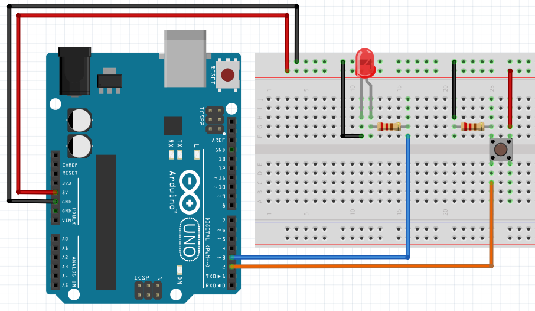

# Getting started with Arduino
Now that you got an LED to blink, it's time to understand exactly how to handle inputs and outputs.

**Inputs** are your way of controling the Arduino; it's how you tell what you want it to do.</br>
Some examples of inputs are buttons, potentiometers, a keypad, or even a touchscreen.</br>
**Outputs**, on the other hand, allow the Arduino to tell you some information.</br>
These can be a blinking LED, a buzzing sound, an LCD screen, ...

In the previous exercise you got to see how to turn an LED on or off using **`digitalWrite()`**. Now, instead of a **`delay()`**, let's use a button.

## Variables and Reading Inputs

Just like there is a **`digitalWrite()`**, there is also a **`digitalRead()`**, which returns the value of a certain digital pin (either *HIGH* or *LOW*). You use it like this:</br>
```Arduino
// Assuming your button is connected to pin 2 on one end
// and to 5V on the other, the variable 'buttonState' will be
// set to HIGH or LOW according to the button
buttonState = digitalRead(2);
```
Now we'll make some connections, as shown below... </br>
 </br>

The simplest Arduino example
 </br>

[Main Menu](../README.md) | [Next](./basicElectronics.md)
