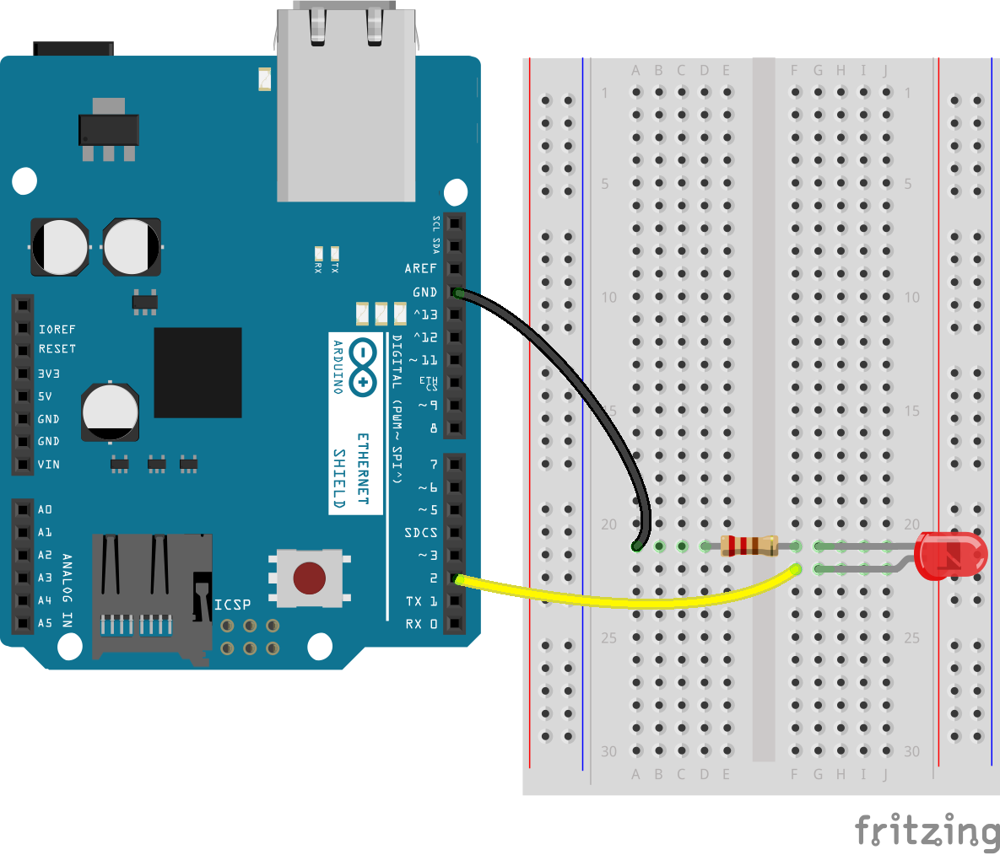

# Hello World
In every programming language, "Hello World" is the most basic program you can write. Now we're going to show you the "Hello World" of Arduino programming.

Every Arduino user agrees that the most basic *sketch* you can make is **Blink**, the example that you find in the IDE (as you saw in the previous topic). Let's try that again, and truly understand what is happening...

Go to **File > Examples > Basics > Blink**. You should now have something like this:
> To place some comment on your code use **"/\*"** at the beggining and **"\*/"** at the end of your comment. The compiler will ignore whatever you write in between, which is helpful to leave some reminders for later.
> <br>Alternatively, you can use **"//"** - everything which comes after this mark is also ignored. **But only in that same line!**

```Arduino
void setup() {
  // initialize digital pin LED_BUILTIN as an output.
  pinMode(LED_BUILTIN, OUTPUT);
}

// the loop function runs over and over again forever
void loop() {
  digitalWrite(LED_BUILTIN, HIGH);   // turn the LED on (HIGH is the voltage level)
  delay(1000);                       // wait for a second
  digitalWrite(LED_BUILTIN, LOW);    // turn the LED off by making the voltage LOW
  delay(1000);                       // wait for a second
}
```

The portion of code in ```void setup()``` is run only once - when the Arduino turns on or when it is reset.<br>
As you might have guessed, the portion inside the ```loop()``` keeps running in an infinite loop, forever.

```LED_BUILTIN``` represents the LED that is mounted on the board. *(compile it to confirm!)*<br>
But we don't want to use the built-in LED, we have our own! Let's make following connections:



Now, instead of ```LED_BUILTIN```, we could simply use ```2```, but that doesn't seem very elegant.<br>
In the beginning of the code (before the setup) we can use ```#define LED_PIN 2``` and then replace LED_BUILTIN with LED_PIN.

> **#define X Y**, like **#include** is a special command that you use in the beggining of code. It tells the compiler "In this program, everytime you see the word X, replace it with Y".<br>
> In fact, LED_BUILTIN is also defined, and it actually stands for 13 in the Arduino UNO.<br>
> Why is this useful? Imagine you're making a huge program, where you use multiple pins, multiple times. You see how this would become really difficult very fast? If, for some reason, you now need to connect your LED to pin 3, you only need to change **one value** which is far less confusing.

NOTE: pay attention to the code line : "delay(1);". This is a good practice because it forces the microprocessor to wait and not just running as fast as it can. ( There are more theoretical aspects about this note, but that's enough)

```c++

void setup(){
   Serial.begin(9600);
   Serial.println("Hello World");
}

void loop(){
 delay(1);
}  
```
[Main Menu](../README.md) | [Next](./onOff.md)
