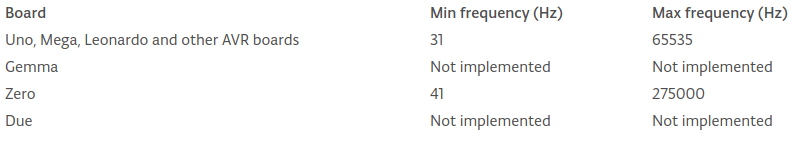

# Musical Genius

To demonstrate that the Arduino can do pretty much everything, we decided to give all the participants a buzzer! (probably the worst decision of our lives)<br>
My ears are not going to suffer at all... :grin:

> Now seriously, leave the torture for later. Play at will, but please don't turn the room into an orchestra gone bad.

## The 'Tone' Function

You are now familiar with the Arduino, the IDE, and the basics.<br>
In this topic, you can free your skills and creativity and use the knowledge you recently gained.

Now we'll introduce new functions and programming techniques, and by the end we hope you make somthing neat!<br>

### Google is your best friend...
Search for **"arduino tone"** on Google (or your favourite search engine). The first result you will find will show you how to use the ```tone(...)``` function. You also have some examples in **File > Examples > Digital > ...**

>Keep in mind only one tone can be generated at a time. If a tone is already playing on a different pin, the call to tone() will have no effect. If the tone is playing on the same pin, the call will set its frequency.<br>
> Note: Use of the tone() function will interfere with PWM output on pins 3 and 11 (on boards other than the Mega).

 </br>

[Main Menu](../README.md) | [Next](./stopEverything.md)
