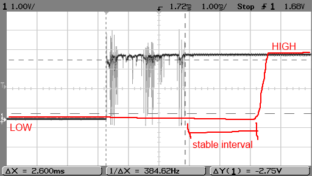

# On/Off

Now that you got an LED to blink, it's time to understand exactly how to handle inputs and outputs.

**Inputs** are your way of controling the Arduino; it's how you tell what you want it to do.</br>
Some examples of inputs are buttons, potentiometers, a keypad, or even a touchscreen.</br>
**Outputs**, on the other hand, allow the Arduino to tell you some information.</br>
These can be a blinking LED, a buzzing sound, an LCD screen, ...

In the Blink example you got to see how to turn an LED on or off using **`digitalWrite()`**. Now, instead of a **`delay()`**, let's use a button.

## Variables and Reading Inputs

Just like there is a **`digitalWrite()`**, there is also a **`digitalRead()`**, which returns the value of a certain digital pin (either *HIGH* or *LOW*). You use it like this:</br>
```Arduino
// Assuming your button is connected to pin 2 on one end
// and to 5V on the other, the variable 'buttonState' will be
// set to HIGH or LOW according to the button
buttonState = digitalRead(2);
```
Now we'll make some connections, as shown below... </br>
 </br>

We can define some helpful variables, set the LED as output and the Button as input.</br>
(setting the ledPin as *OUTPUT* and the buttonPin as *INPUT* is mandatory and must be done during the setup)
```Arduino
const int buttonPin = 2;          // Pushbutton pin
const int ledPin =  3;            // The LED pin
int buttonState = 0;              // Variable for reading the button status

void setup() {
  pinMode(ledPin, OUTPUT);        // Initialize the LED pin as an output
  pinMode(buttonPin, INPUT);      // and the pushbutton pin as an input
}
```
Now, inside the loop, we will read the button state, and turn the LED on/off accordingly.</br>
To do that, we will use an **`if(`*`condition`*`) {`*`action`*`}`** (which is pretty self-explainatory).
```Arduino
void loop() {
  buttonState = digitalRead(buttonPin);  // Read the state of the button
  
  if (buttonState == HIGH) {             // Check if the button is pressed
    digitalWrite(ledPin, HIGH);          // Turn LED on
  } else {
    digitalWrite(ledPin, LOW);           // Turn LED off
  }
}
```
**Compile and upload.** When you push the button, the LED turns on, when you release it, it turns back off.</br>
Now imagine that you want your LED to stay on after you release the button...

## Keeping Values
Let's say we want the LED to switch state (on/off) everytime we push the button.</br>
As the `loop()` funtions occurs many times/second, we can't simply switch when `buttonState == HIGH`, or else the LED would keep flickering when the button is pressed.
To avoid that, we need some new variables (also declared before the setup):
```Arduino
int ledState = HIGH;              // Current state of the LED
int lastButtonState = LOW;
```
Inside the `setup()` you should also set the initial LED state.
```Arduino
digitalWrite(ledPin, ledState);   // Set  the initial LED state
```

Now, in every `loop()`, we must check the real current state of the button with *`digitalRead(buttonPin)`* and compare it with the *`lastButtonState`*. If those two are not the same, it means someone either **pushed** or **released** the button.</br>
If the state is now *HIGH*, someone has just pushed the button (and we can turn the LED on or off).

> You can compare a state with the previous one using the operator **`!...`** which means **"NOT"**:</br>

It is also a good time to talk about **debouncing**. Usually, due to mechanical and physical issues, pushbuttons generate some "noise" when pressed, which might be read as multiple transitions in a short time. We won't worry too much about that for now, but keep that in mind if you are experiencing some weird results.

 </br>

```Arduino
void loop() {
  buttonState = digitalRead(buttonPin);  // Read the state of the button
  if (buttonState != lastButtonState) {  // The button was just pressed (or released)
    lastButtonState = buttonState;       // Store the current button state, for the next comparison
    if (buttonState == HIGH) {           // It was a press, not a release
      ledState = !ledState;
      digitalWrite(ledPin, ledState);
    }
    delay(50);                           // A small delay helps with the random results
  }
}
```
Now that you master **`digitalRead()`** and **`digitalWrite()`**, you can move on to the next lesson...

[Main Menu](../README.md) | [Next](./takingMeasurements.md)
