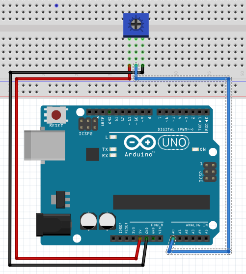
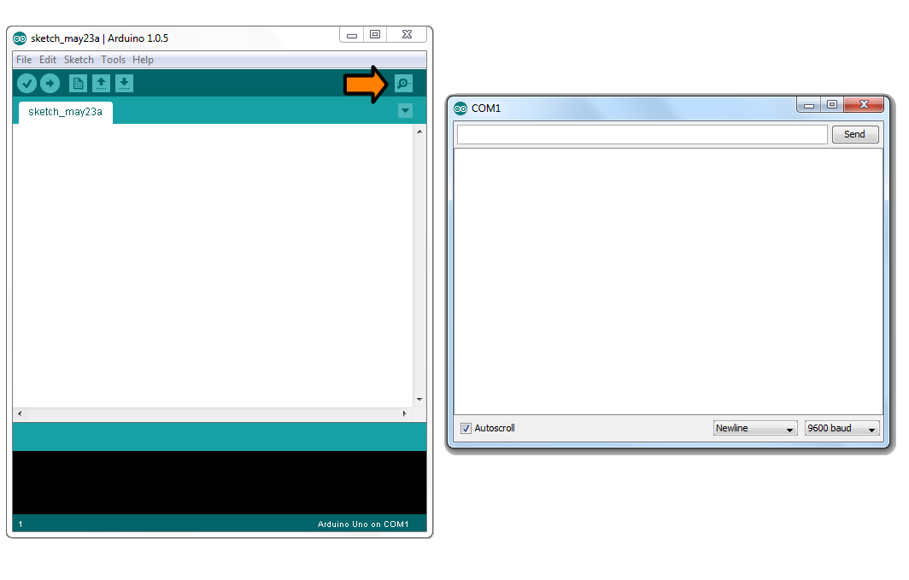
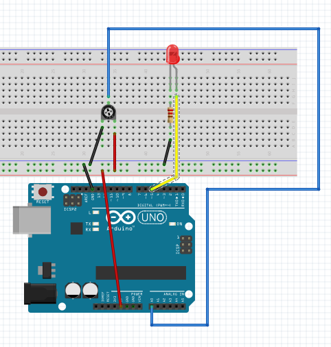
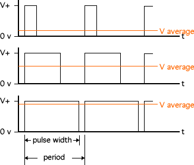

# Taking Measurements

Sure... Digital input and output is very fun and all, but sometimes you need to have a bit more granularity in the interactions of your Arduino with the world.
That is were good old-fashioned analog I/O comes in.

The Atmega chip in your Arduino has a **ADC** (Analog to Digital Converter) built-it that converts all analog signals from 0 to 5V to digital bits. Please note that only the pins that start with an 'A' are connected to the ADC (A0, A1, A2...).

> In the case of the Arduino Uno, the input's max voltage is 5V, but THAT IS NOT THE CASE WITH ALL ARDUINOS. If you apply too much voltage to a pin, **YOU CAN KILL THE ARDUINO!!!** Always check the product page of your Arduino before mounting a circuit with it. You can also check the voltage difference between IOREF and GND if you have a multimeter laying around.

## Analog Read

To see this ADC in action, you'll need to build a circuit with the potentiometer included in your kit.

 </br>

```Arduino

#define pot_pin A0

void setup() {
    Serial.begin(9600);
    pinMode(pot_pin, INPUT);
}

void loop() {
    int potValue = analogRead(pot_pin);
    Serial.println(potValue);
}
```

Don't pay too much atention to the ```Serial``` class. You'll learn all about it later on in [Cheap Talk](./content/cheapTalk.md).

What this code does, is simply read voltage being fed into the A0 pin and display the correspondent digital value in the Serial Monitor. To access the Serial Monitor just click the magnifying glass icon in the upper right corner of the Arduino IDE's interface.

This is what it should look like:

 </br>

Rotate the potentiometer and look at the values on the screen.

As you can see the values oscilate from 0 to 1023. Knowing that, you can hook up a LED to the Arduino and only turn it on, when the value goes over a certain threshold.

 </br>

```Arduino

#define pot_pin A0
#define led_pin 5

void setup() {
    Serial.begin(9600);
    pinMode(pot_pin, INPUT);
    pinMode(led_pin, OUTPUT);
}

void loop() {
    int potValue = analogRead(pot_pin);

    if(potValue >= 500)
        digitalWrite(led_pin, HIGH);
    else
        digitalWrite(led_pin, LOW);

    Serial.println(potValue);
}
```

## "Analog" Output

Unfortunately, the Arduino doesn't truly have a analog output. What it does is "simulate" an analog output by outputing PWM (Pulse With Modulation).

 </br>

By controling the time between pulses, you can change the efective value of the square wave and "simulate" a value between 0 and 5V. PWM is good for a few applications like controling servos, but not optimal when you really need something truly analog.

Using the same circuit as before, try this code and you can see for yourself how you can harness the power of PWM.

```Arduino

#define pot_pin A0
#define led_pin 5

void setup() {
    Serial.begin(9600);
    pinMode(pot_pin, INPUT);
    pinMode(led_pin, OUTPUT);
}

void loop() {
    int potValue = analogRead(pot_pin);

    analogWrite(led_pin, map(potValue, 0, 1023, 0, 255));

    Serial.println(potValue);
}
```

> Please note that not all digital pins can output a PWM signal. Only the pins with a **'~'** before the number.

[Main Menu](../README.md) | [Next](./stopEverything.md)
